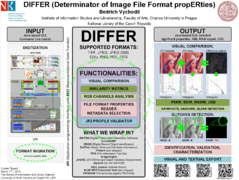

.. Differ Documentation documentation master file, created by
   sphinx-quickstart on Mon Dec 10 10:43:50 2012.
   You can adapt this file completely to your liking, but it should at least
   contain the root `toctree` directive.

The Image Validator - DIFFER
===============================

.. toctree::
   :maxdepth: 2

   introduction
   image-validator-procedure
   web-app
   cmdline-app
   important-links
   gsoc2013-ideas-list
   old-index

.. raw:: html

	 <a href="poster.png" onclick="window.open(this.href); return false;" onkeypress="window.open(this.href); return false;">

.. raw:: html
	 </a>

.. raw:: html

	 <a href="https://docs.google.com/file/d/0B9Ah7Og9gY_ORi1kandLZVJ2NEU/preview" onclick="window.open(this.href); return false;" onkeypress="window.open(this.href); return false;">Poster at Google Disc</a>

